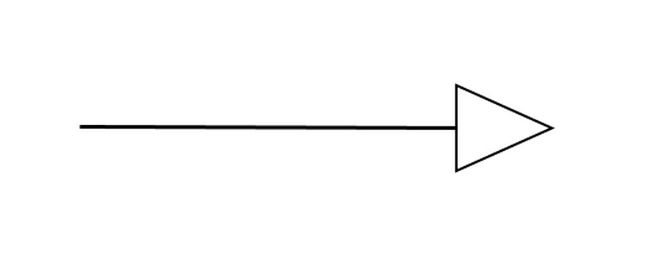

Aprendiz:

Santiago Gordo Perez 3145555
Tema:

Herencia, tipos de Herencia, Clase padres e hijas, sobre escritura

Herencia:

La herencia es un mecanismo que permite que una clase (llamada clase hija o subclase) adquiera los atributos y metodos de otra clase (llamada clase padre o superclase).

Gracias a la herencia, se puede reutilizar codigo, extender funcionalidades existentes y establecer relaciones jerarquicas entre clases.En otras palabras, la herencia permite crear nuevas clases basadas en clases ya definidas, evitando repetir codigo y promoviendo la reutilizacion.

Como se puede ver en la imagen es como se ve graficamente en UML 

La linea sale de la clase hija y la punta del triangulo llega a la clase padre.

Ejemplos:  

Nº1

class Animal {

    void comer() {
        System.out.println("El animal come.");
    }
}

class Perro extends Animal { }  
comer()

public class Main {

    public static void main(String[] args) {
        Perro p = new Perro();
        p.comer(); 
    }
}

Nº2

class Vehiculo {

    void mover() {
        System.out.println("El vehiculo se mueve.");
    }
}

class Auto extends Vehiculo { } 
mover()

public class Main {

    public static void main(String[] args) {
        Auto a = new Auto();
        a.mover();  
    }
}

Nº3

class Persona {

    void hablar() {
        System.out.println("La persona está hablando.");
    }
}

class Profesor extends Persona { }  
hablar()

public class Main {

    public static void main(String[] args) {
        Profesor profe = new Profesor();
        profe.hablar();
    }
}

Nº4

class Dispositivo {

    void encender() {
        System.out.println("El dispositivo está encendido.");
    }
}

class Celular extends Dispositivo {}
encender()

public class Main {

    public static void main(String[] args) {
        Celular c = new Celular();
        c.encender(); 
    }
}

Nº5

class Cuenta {

    void abrir() {
        System.out.println("La cuenta fue abierta.");
    }
}

class CuentaAhorros extends Cuenta { } 
abrir()

public class Main {

    public static void main(String[] args) {
        CuentaAhorros ca = new CuentaAhorros();
        ca.abrir();
    }
}

Tipos de Herencia:

Nº1: 

Herencia Simple: Una clase hija hereda de una sola clase padre es el tipo mas comun de herencia.

Nº2:

Herencia Multinivel: Una clase hija sirve como padre de otra clase, formando una cadena.

Ejemplo:

class SerVivo { }

class Animal extends SerVivo { }

class Perro extends Animal { }

Perro hereda de Animal, y Animal hereda de SerVivo.

Nº3:

Herencia Jerarquica: Varias clases hijas heredan de una misma clase padre.

Ejemplo:

class Vehiculo { }

class Auto extends Vehiculo { }

class Moto extends Vehiculo { }

Tanto Auto como Moto heredan de Vehiculo.

Nº4:

Herencia Multiple: Una clase hija hereda de dos o mas clases padre.

Java y C# no la permiten directamente, pero se puede lograr con interfaces.

En C++ si es posible.

Ejemplo:

class Volador { };

class Nadador { };

class Pato : public Volador, public Nadador { };

Pato hereda de Volador y Nadador.

Nº5:

Herencia Hibrida: Es una combinacion de varios tipos de herencia (por ejemplo, jerarquica + multinivel).

Se usa con cuidado para evitar ambiguedades.

Sobreescritura:

La sobreescritura ocurre cuando una clase hija redefine un método que ya existe en la clase padre, con el mismo nombre, parámetros y tipo de retorno, pero con un comportamiento diferente.

En pocas palabras:

La clase hija reemplaza el comportamiento heredado de su clase padre por uno propio.

Características principales

Solo aplica cuando hay herencia.

El método en la clase hija debe tener exactamente la misma firma (nombre y parámetros) que en la clase padre.

En lenguajes como Java, se usa la anotación @Override para indicar que se está sobrescribiendo un método.

Permite modificar o personalizar comportamientos sin alterar la clase original.

Clase Padre:

La clase padre es la clase base o principal de la que otras clases heredan atributos y métodos.
Es decir, contiene las características comunes que pueden ser reutilizadas por otras clases.

Piensa en la clase padre como un molde general que define lo que todas las clases hijas tendrán en común.

Clase Hija:

La clase hija es la que hereda de la clase padre.
Recibe automáticamente los atributos y métodos de la clase padre y puede además:

Usarlos directamente.

Agregar nuevos métodos o atributos.

Sobrescribir (modificar) los métodos heredados.