santiago Gordo Perez
Documentacion de docker
3145555

Punto #1

Con un Formato de docker compose realizamos el primer punto el cual en docker crear la imagen y el contenedor de los cuatro motores de base de datos (MySQL, SQLServer, PostgreSQL y MondoDB) cada uno trabajando correctamente.

Con docker compose nos genera documento .YLM en donde nos crea la imagen y el contenedor Como se puede observar en la imagen:

En esta imagen podemos observar bien como se crea la imagen el contenedor de MySQL:
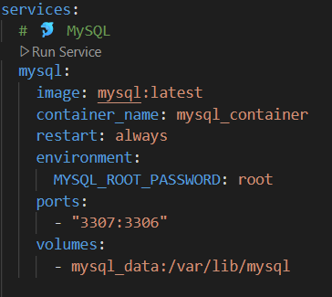

En esta imagen podemos observar como se crea la imagen y el contenedor de PostgreSQL:
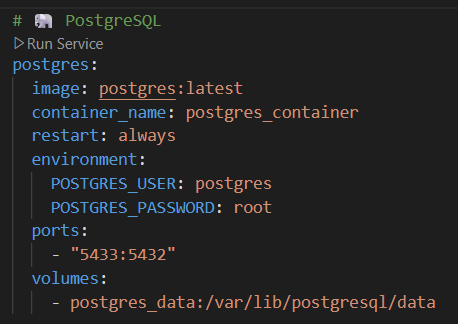

En esta imagen podemos observar como se crea la imagen y el contenedor de SQLServer:
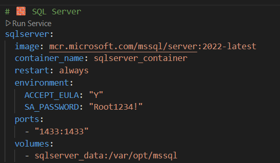

En esta imagen podemos observar como se crea la imagen y el contenedor de MongoDB:
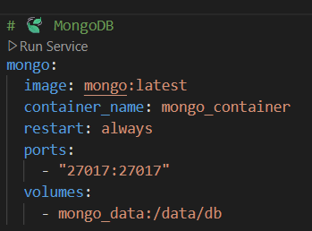

Luego de haber creado el documento .YML que se nos genera con el docker compose vamos a la carpeta en donde tenemos guardado el documento y en la carpeta la abrimos en terminal y ejecutamos este comnado:

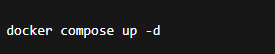

Esto nos descargará las imágenes y levantará los 4 contenedores.

Luego para verificar ponemos este otro comando y verificamos si se nos descargo y se levantaron los cuatro contenedores y que todo este corriendo

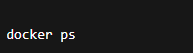

Luego en docker nos deberia aparecer haci como se muestra en la imagen:

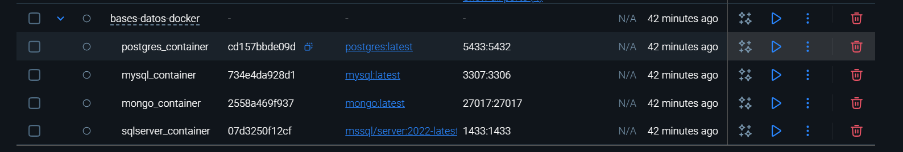

y listo esto ya vemos que hemos creado todo correctamente.

Punto #3

Creamos el contenedor Ubuntu con el siguiente comando:

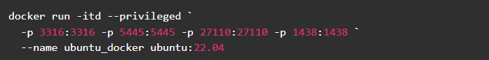

con esto creamos y arranca el contenedor.

con el siguiente comando verificamos que se halla creado correctamente el contenedor

con el siguiente comando entramos al contendor que acabamos de crear

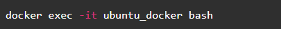

Verás el prompt root@...:/#. 

Luego vamos a descargar docker dentro de ubuntu.

Primero actualizamos los repositorios de ubuntu

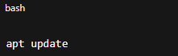

con esto Actualiza la lista de paquetes disponibles y sus versiones desde los repositorios configurados.

Luego instalamos las herramientas y dependencias necesarias con este comando:

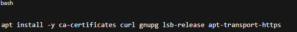

Luego Creamos la carpeta donde se guarda la llave GPG que validan los paquetes del sitio oficial con el siguiente comando:

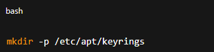

Luego Descargamos y guardamos la llave oficial de Docker:

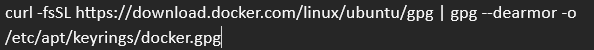

Agregar el repositorio oficial de Docker a las fuentes de APT

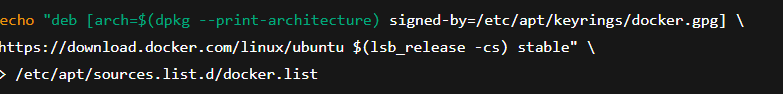

Actualizar la lista de paquetes otra vez

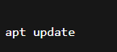

Instalar Docker CE y sus componentes

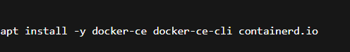

Creamos una red interna que se llama redes_bd en docker donde conectaremos todos los contenedores de base de datos:

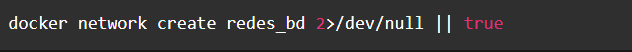

Con este comando creamos un contenedor MySQL en la red redes_bd:

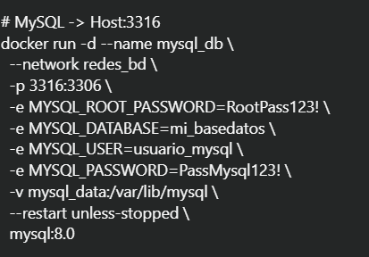

Con este comando creamos un contenedor PostgreSQL en la red redes_bd:

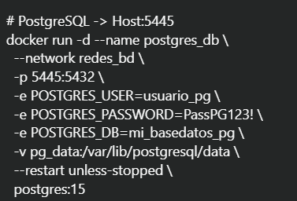

Con este comando creamos un contenedor SQLServer en la red redes_bd:

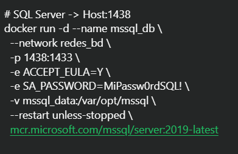

Con este comando creamos un contenedor MongoDB en la red redes_bd:

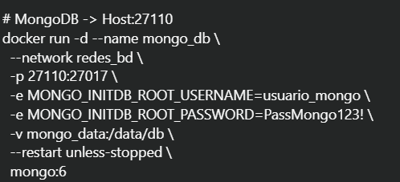

Verificación dentro del Ubuntu:

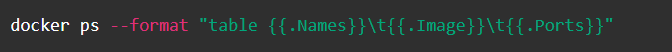

Y ya con esto nos podemos conectar en los 4 motores de base de datos con el host, user y password que le pusimos anteriormente.